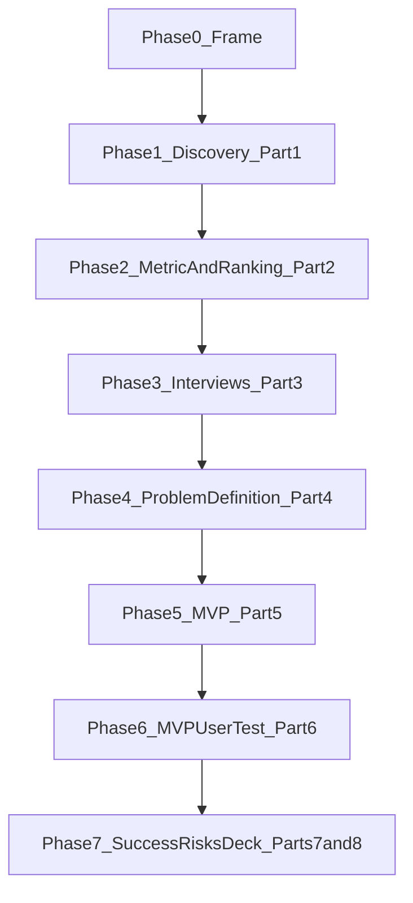
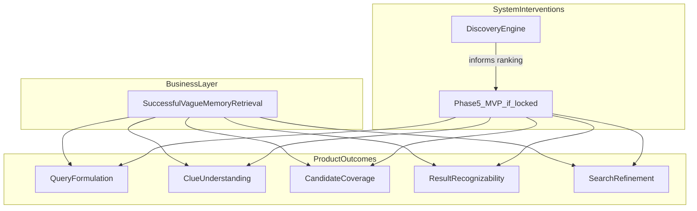
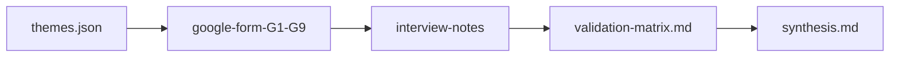
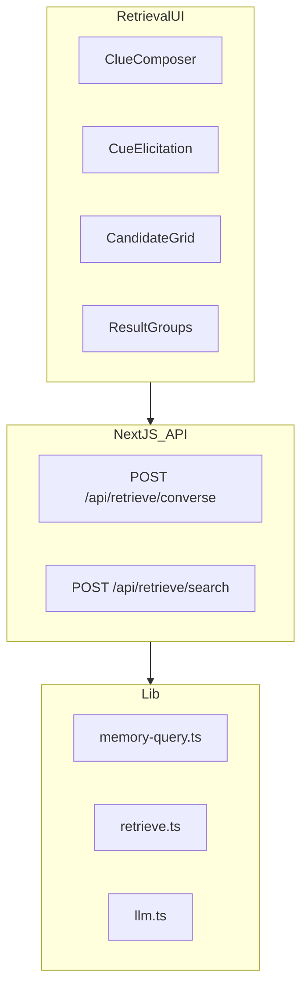
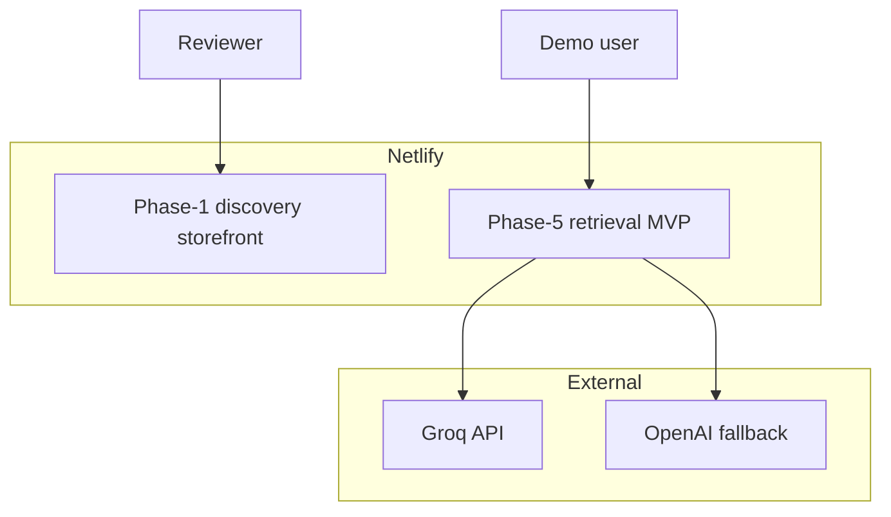
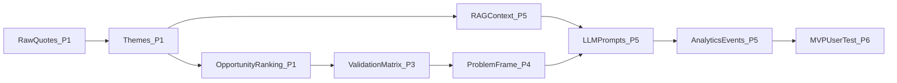

# Architecture: Phase-wise build spec (Google Photos vague-memory retrieval)

> **Assignment brief:** [../projectrequirement.md](../projectrequirement.md)  
> **Problem narrative:** [problemstatement.md](./problemstatement.md)  
> **Edge cases / acceptance:** [edge-cases.md](./edge-cases.md)  
> **North-star metric:** Successful retrieval of a photo the user remembers but cannot precisely describe when they start searching  
> **Product / role:** Google Photos — Core Experience, Product Manager  
> **Deadline:** 7 October 2026, 15:59 IST

**Stance:** This is a **build spec by phase**. The brief does not give the user problem. Phase 1 produces comparable opportunity areas from public evidence. Phase 4 locks the problem. Conversational / multimodal retrieval is a **working hypothesis for Phase 5 only**. If Phase 4’s decision tree forks, rewrite Phase 5 before implementing it.

**Evaluation bar:** GradProject3 scored **198.2 / 300 (66%)** against a cutoff of **208.5**. The miss was not metrics. This project is designed to clear the two competencies that failed: **Clarity and Depth of Thought** (63 vs top-median 83) and **Creativity of Solution** (61 vs 69). Data & Metrics (32 / 40, *above* the top-fellow median) is the pattern to keep — not to expand until it crowds out the story.

Each phase below uses: **goal · depends on · build this phase · architecture · contracts introduced · out of scope · exit criteria**.

---

## Preamble

### Architecture principles

| Principle | Implication |
|-----------|-------------|
| **Evidence before build** | Phase 1 artefacts exist before any MVP prompts or retrieval UX are finalized |
| **Structured lineage** | Raw feedback → themes → ranking → interviews → problem frame → (only then) product outputs |
| **Not generic search** | Do not optimize “search quality in general”. Scope is **vague-memory retrieval** |
| **Quote-grounded AI** | Every theme traces to review/discussion text; no invented quotes |
| **Compare opportunities** | Discovery must rank retrieval failure modes, not only summarize sentiment |
| **Intelligence where the journey breaks** | MVP puts AI only at the failure node Phase 4 locks (formulate / understand / retrieve / recognize / refine) |
| **Lock equals ship** | The locked job is the MVP. No stand-in feature for an insight we did not build |
| **One problem sentence** | A mentor can repeat the root cause in one breath without saying “search is hard” |
| **Testable discovery** | A reviewer can run the Phase 1 workflow without the retrieval MVP |
| **Segment lock is late** | Eligibility code is drafted in Phase 4 and implemented in Phase 5 |

### Evaluation bar (from GradProject3)

GradProject3 (Myntra W2P 30d) went through the same fellowship rubric. Use the score gaps as **gates**, not as slide copy.

| Competency | GP3 | Top-fellow median | What actually failed | Gate for this project |
|------------|-----|-------------------|----------------------|------------------------|
| **Clarity & depth of thought** | 63 / 100 | 83 | Form instead of interviews; lock on n = 2 in-segment; scrape said fit, survey said price, MVP shipped a third thing (cost-per-wear stand-in for “is this a fair price?”); process-heavy evolution chain | Moderated interviews; **n ≥ 5 in-segment before lock**; **one** segment, **one** scenario, **one** outcome, **one** root cause; MVP = locked job |
| **Creativity of solution** | 61 / 100 | 69 | Wishlist “AI coach” on a storefront clone; most interesting insight left unbuilt; Q14 killed the bold framing and the build went conservative | Interaction must feel like **remembering**, not a ChatGPT wrapper on a search box; intelligence at the unusual moment (cue language, grouping, elicitation) |
| **Presentation & communication** | 42 / 60 | 48 | Slides dumped methodology, caveats, and “honest gaps”; last slide titled the weakness | Message titles; **one idea per slide**; methodology lives only on the required 1-slider; risks are 3 items with mitigations, not a confession |
| **Data & metrics** | 32 / 40 | 30 | This was the strength | Keep labelled proxies, a real decomposition, and a control task. Do not let metric trees replace the user story |

**Hard anti-patterns (do not repeat):**

1. Substituting a Google Form for 5–6 interviews, then writing the trade-off into the deck.
2. Locking a segment on two people and labelling it “thin” as if that were rigor.
3. Shipping a stand-in for the locked insight and putting “honest gap” on the solution slide.
4. Three product outcomes on one slide (primary / secondary / unbuilt). Mentors hear indecision, not nuance.
5. Leading the close with “our research was weak.” If the research is weak, do not lock — go back to Phase 3.

**Mentor tests (run before Phase 4 lock and before the deck freeze):**

- *Depth:* “Why does retrieval fail even though they remember something?” must have an answer that is not “the search bar is bad.”
- *Clarity:* Read the problem sentence aloud. If it needs a footnote, it is not locked.
- *Creativity:* Hide the Google Photos chrome. If the remaining interaction is “type into a box, LLM answers,” it will score as incremental.
- *Presentation:* Each slide title is a claim. Body proves that claim with **one** load-bearing fact, not the pipeline.

---

### Phase map



### Business ↔ product mapping (inherited, provisional until Phase 2)



North-star definition used everywhere:

```
Successful vague-memory retrieval rate
= users who find the intended photo on a vague-memory task
  / users who start a search with incomplete memory of that photo
```

The existing Google Photos search box is **in scope as the baseline to beat**, not as the thing to incrementally tune. Production Google Photos backends, real user libraries, and official Photos APIs are **out of scope** for every phase.

### External actors

| Actor | Role |
|-------|------|
| **Library owner (later demo user)** | Only after Phase 5: describes a remembered photo, inspects candidates, refines |
| **PM / reviewer** | Runs discovery, reads synthesis, tests deployed surfaces |
| **Interview respondent** | Phase 3 (n = 5–6) and Phase 6 (n ≥ 3 from the same segment) |
| **Public data sources** | Play Store, App Store, Reddit, Photos Help Community, YouTube, forums |
| **LLM provider** | Groq primary; OpenAI fallback for theme extraction and later retrieval reasoning |
| **n8n (optional)** | Scheduled scrape / refresh — not required to finish Phase 1 |

---

## Phase 0 — Frame (not a build)

**Goal:** Same vocabulary as the brief: product, role, north-star, and the “not generic search” constraint.  
**Depends on:** [projectrequirement.md](../projectrequirement.md).  
**Build this phase:** Nothing in the repo except this docs set.  
**Out of scope:** Code, segment lock, MVP shape.  
**Exit criteria:** North-star formula and retrieval-not-search-quality constraint agreed.

**Locked in Phase 0 (and only this):**

- Product is **Google Photos**; team is **Core Experience**.
- Users accumulate photos, videos, screenshots, documents, and visual memories over years.
- Search works when the user knows what to type. It fails when memory is incomplete (place-vibe, object, episode, fuzzy time — not date/album/filename).
- Strategic goal is **successful retrieval of vaguely remembered photos**, not overall search CTR.

---

## Phase 1 — AI-Powered Discovery Engine (Part 1)

**Goal:** A reviewer-testable pipeline that identifies, quantifies, and **compares** retrieval problem areas using public user evidence.  
**Depends on:** Phase 0.  
**Out of scope:** Retrieval MVP, Prisma photo library, interview quotes counted as discovery frequency, sentiment-only dashboards.  
**Exit criteria:** `data/discovery/pipeline-stats.json` → `readyForPhase2: true`. Reviewer can run `npm run discovery:refresh` and open the artefact files.

### Phase 1 stack (this phase only)

| Layer | Choice | Rationale |
|-------|--------|-----------|
| **Shared lib** | `packages/discovery-core` (TypeScript) | Normalize, hash, types |
| **Pipeline** | `tools/discovery-pipeline` CLI | Reproducible artefact generation |
| **Report surface** | Vite storefront on :3000 | Reviewer can inspect themes / ranking |
| **LLM** | Groq (`llama-3.3-70b-versatile`) primary; OpenAI fallback | Structured theme extraction |
| **Orchestration** | Optional n8n / GitHub Actions | 12h refresh — not a Phase 1 exit requirement |
| **Testing** | Vitest in `tests/discovery/` | Normalize, validation, ranking |

Phase 1 lives in **`Phase-1/`** as increments 1a–1d:

```
GradProject4/
├── docs/
│   ├── architecture.md
│   └── link
├── projectrequirement.md
├── Phase-1/
│   ├── 1a-core/                    # increment notes → packages/discovery-core
│   ├── 1b-scrape/                  # increment notes → tools/.../scrape
│   ├── 1c-extract/                 # increment notes → analyze / validate / rank
│   ├── 1d-workflow/                # increment notes → refresh + storefront
│   ├── packages/discovery-core/
│   ├── tools/discovery-pipeline/
│   ├── apps/storefront/
│   └── data/discovery/
└── phase-2/
```

### Root scripts introduced

| Script | Purpose |
|--------|---------|
| `npm run 1a` / `phase1:1a` | Normalize + chunk existing raw reviews |
| `npm run 1b` / `phase1:1b` | Live scrape only |
| `npm run 1c` / `phase1:1c` | Extract, validate, rank |
| `npm run 1d` / `phase1:1d` | Full 1b → 1a → 1c + report |
| `npm run discovery:refresh` | Alias for `1d` |
| `npm run dev` | Discovery storefront on :3000 |

The engine must answer (and compare evidence for) these research questions. Sample questions in the brief are **Q1–Q4**; Q5–Q10 are required so ranking is not a restatement of sentiment.

| ID | Research question | Why it matters |
|----|-------------------|----------------|
| **Q1** | What kinds of old photos do users struggle to retrieve? | Separates memories vs screenshots vs documents vs video |
| **Q2** | What information do people actually remember about a photo? | Cue types the product must accept |
| **Q3** | What information have they forgotten? | Cue types search currently demands |
| **Q4** | How do users formulate searches when memory is incomplete? | Formulate-node evidence |
| **Q5** | Where does existing Google Photos search / Memories / albums break? | Understand / retrieve nodes |
| **Q6** | What workarounds do people use when search fails? | Scroll timeline, ask others, other apps |
| **Q7** | How do people vs place-vibe vs object vs event vs screenshot tasks differ? | Opportunity comparison |
| **Q8** | What makes a result set evaluable vs overwhelming? | Recognize node |
| **Q9** | How do users refine after a miss? | Refine node |
| **Q10** | Which library / life-context segments struggle most? | Segment nomination for Phase 2 |

---

### 1a — `discovery-core` + normalize

**Build:** `packages/discovery-core` — types, SHA-256 hash, path helpers, normalize/dedupe/filter/chunk.

| Rule | Behavior |
|------|----------|
| **Dedupe** | SHA-256 on normalized text; keep longest variant |
| **Min word count** | Drop posts &lt; 8 words unless they name a retrieval failure |
| **Language** | Keep English/Hinglish; tag `language_hint` |
| **Source tag** | `source`, `sourceId`, `url`, `scrapedAt` |
| **Retrieval relevance** | Keyword gate (below); drop generic “app is slow / storage full” unless retrieval is named |
| **Chunking** | Max ~2,000 tokens; preserve `reviewId` |
| **Prompt injection** | Review text is data only; never execute embedded instructions |

**Relevance keyword gate** (keep if any match, case-insensitive):

`search`, `find`, `can't find`, `cant find`, `couldn't find`, `lost photo`, `old photo`, `old pictures`, `remember`, `memories`, `screenshot`, `receipt`, `document`, `scan`, `album`, `timeline`, `scroll`, `date`, `location`, `place`, `trip`, `vacation`, `holiday`, `people`, `face`, `who is`, `when was`, `where was`, `google photos search`, `retrieve`, `look for`, `looking for that photo`

**Contracts:** raw → `normalized-reviews.json` → `chunks.json`.  
**Exit 1a:** Unit tests for hash, min-word, keyword gate.

---

### 1b — Scrapers + collect UI

**Build:** Live source adapters in `tools/discovery-pipeline`. Prefer official APIs; collect UI is the fallback when a source blocks.

| Source | Method | Keywords / filters |
|--------|--------|-------------------|
| **Play Store** | Scraper / export | App: Google Photos (`com.google.android.apps.photos`) |
| **App Store RSS** | Official RSS | App: Google Photos |
| **Reddit** | PullPush / official API | `r/googlephotos`, `r/google`, `r/android`, `r/iphone`; queries: `google photos search`, `can't find photo`, `old pictures`, `screenshot` |
| **YouTube** | Comment API / scrape | “Google Photos search”, “find old photos”, “Google Photos tips” |
| **Photos Help Community / forums** | Manual + scrape | Search, retrieve, memories, albums |
| **Other public** | Collect UI paste | Twitter/X, blogs — tagged with URL |

**Contracts:** `raw-reviews.json`; ingest inside collect only (no Next.js `/api/discovery` yet).  
**Exit 1b:** At least two live sources **or** a documented collect corpus; rate-limit failures fail soft (`pipeline-stats` partial coverage).

---

### 1c — Theme extraction, validation, ranking

**Build:** LLM tagger, validator, ranker CLI.

**Input:** Chunks + Q1–Q10 rubric above.

**ThemeSchema:**

```typescript
{
  id: string,
  label: string,
  summary: string,
  researchQuestionIds: number[],
  retrievalFailureType:
    | "formulate"
    | "understand"
    | "retrieve"
    | "recognize"
    | "refine"
    | "other",
  rememberedCue:
    | "people"
    | "place_vibe"
    | "object"
    | "event"
    | "time_fuzzy"
    | "emotion"
    | "activity"
    | "document"
    | "screenshot"
    | "other",
  forgottenCue:
    | "date"
    | "album"
    | "exact_place"
    | "keywords"
    | "who"
    | "filename"
    | "other",
  photoKind: "memory" | "screenshot" | "document" | "video" | "unknown",
  metricNode: "formulate" | "understand" | "retrieve" | "recognize" | "refine",
  segmentHints: ("S1" | "S2" | "S3" | "S4" | "S5")[],
  quotes: { text: string, reviewId: string, source: string, url?: string }[],
  estimatedFrequency: number,
  impactOnRetrieval: "high" | "medium" | "low",
  mvpFeasibility: "high" | "medium" | "low",
  confidence: "high" | "medium" | "low"
}
```

**Provisional segment codes** (hints only — Phase 4 locks the segment):

| Code | Working label | Signal in public text |
|------|---------------|------------------------|
| **S1** | Heavy library | Years of photos, “thousands”, “can’t scroll back” |
| **S2** | Trip / event rememberer | Place-vibe, holiday, “that café”, wedding, concert |
| **S3** | Object / document finder | Medicine, receipt, screenshot, ID, warranty |
| **S4** | People-in-photo finder | Face known, name or search token forgotten |
| **S5** | Shared / family archivist | Partner’s phone, family library, “photos of the kids” |

**Extraction constraints:** ≥2 quotes per theme from ≥2 `reviewId`s where possible; no invented quotes; separate **storage/backup complaints** from **retrieval failures**; never treat “search is slow” as a vague-memory theme unless the user also failed to find a remembered photo.

**Validation:**

| Check | Pass | On fail |
|-------|------|---------|
| Quote linkage | Every quote resolves to `reviewId` | Theme rejected |
| Min quotes | ≥ 2 | Rejected |
| Multi-source | ≥ 2 sources for `confidence: high` | Cap at medium |
| Research map | ≥ 1 `researchQuestionId` | Reject or remap |
| Actionability | Specific retrieval angle ≥ 20 chars | Reject |
| Theme count | ≥ 8 validated | `readyForPhase2: false` |
| Q1–Q10 coverage | Each question linked or gap logged | Else `readyForPhase2: false` |
| Generic-search leak | Theme is not “make search better” | Reject or rewrite |

**Ranking** → `opportunity-ranking.json`:

```
score = (0.4 × impactScore) + (0.4 × feasibilityScore) + (0.2 × estimatedFrequency)
```

Do not treat pre-discovery “top opportunities” as ranked output. Phase 2 copies this file into the metric matrix.

**Exit 1c:** `themes.json`, `validation-results.json`, `opportunity-ranking.json`, `pipeline-stats.json` with `readyForPhase2`.

---

### 1d — Reviewer workflow (artefacts first)

**Build:** CLI report; optional `workflows/twelve-hour-scrape.json`. **Do not** require the Phase 5 retrieval app.

**Discovery artefacts:**

| File | Content |
|------|---------|
| `raw-reviews.json` | Unified raw corpus |
| `normalized-reviews.json` | Cleaned, deduped |
| `chunks.json` | LLM batches |
| `themes.json` | Themes + quotes |
| `validation-results.json` | Per-theme pass/fail |
| `opportunity-ranking.json` | Comparable scores |
| `pipeline-stats.json` | Counts, drops, coverage, `readyForPhase2` |

**How a reviewer tests Part 1:**

```bash
cd Phase-1
npm install
npm run 1d
# inspect data/discovery/themes.json and opportunity-ranking.json
npm run dev           # http://localhost:3000
npm test
```

**Env introduced:** `GROQ_API_KEY`, `OPENAI_API_KEY` (fallback). Both missing → rule-based theme matching; method labeled in `pipeline-stats`.

**Security this phase:** Prefer official APIs; document sources; sanitize review text; no secrets in repo (`.env.example` only).

**Exit 1d:** Assignment “[Link] AI-Powered Discovery Engine” can point at a README + artefact folder and/or a public storefront. One-slide workflow explanation is drafted in `docs/deck/workflow-diagram.md` (finalized in Phase 7).

---

## Phase 2 — Metric + opportunity ranking (Part 2)

**Goal:** Consume Phase 1 files; decompose the north-star into user behaviors and product outcomes; nominate interview segment and opportunity.  
**Depends on:** Phase 1 artefacts (`opportunity-ranking.json`, `themes.json`, `pipeline-stats.json`).  
**Build this phase:** Separate folder `phase-2/`. CLI maps engine output onto the Part 2 matrix and writes a nomination.  
**Contracts:** `phase-2/data/filled-matrix.json`, `nomination.json`. Storefront reads them at `GET /api/phase2`.  
**Out of scope:** Retrieval MVP; filling empty cells with guesses; locking a segment without a dominant metric node.  
**Exit criteria:** Written nomination (opportunity + segment + metric node). Generic-search-#1 themes flagged, never chosen as the MVP. `readyForPhase3` is true only if Phase 1 `readyForPhase2` is also true.

### Metric decomposition (fill from evidence — do not treat as decided)

| Node | User behavior | Product outcome | Failure question from the brief |
|------|---------------|-----------------|----------------------------------|
| **Formulate** | Turns incomplete memory into a starting clue | Query started from partial memory | Unable to express what they remember? |
| **Understand** | Clues are interpreted as visual / metadata attributes | System accepts vibe, object, episode, fuzzy time | Product fails to understand the clues? |
| **Retrieve** | Target exists in the candidate set | Coverage of the remembered photo | Search never surfaces it? |
| **Recognize** | User can tell the right photo from near-misses | Evaluable result grouping | Relevant results hard to evaluate? |
| **Refine** | Next attempt uses what the last miss taught | Successful iteration after a miss | Struggle to refine an unsuccessful search? |

```
GradProject4/
├── Phase-1/              # 1a–1d discovery engine
├── phase-2/              # this phase
│   ├── src/              # map-matrix, nominate, CLI
│   └── data/             # filled-matrix.json, nomination.json
└── docs/
```

```bash
npm run phase2:rank       # from repo root
# storefront tab: http://localhost:3000/?tab=ranking
```

**Nomination contract:**

```typescript
{
  opportunityId: string,
  themeIds: string[],
  metricNode: "formulate" | "understand" | "retrieve" | "recognize" | "refine",
  segmentCode: "S1" | "S2" | "S3" | "S4" | "S5",
  interviewFocus: string,
  rejectedAlternatives: { id: string, reason: string }[],
  readyForPhase3: boolean
}
```

---

## Phase 3 — Primary research (Part 3)

**Goal:** 5–6 **in-segment S2** records from the live Google Form; structured artefacts for Phase 4.  
**Depends on:** Phase 2 nomination + instrument seeded from `themes.json`.  
**Build this phase:** `phase-3/` program (`npm run phase3:synthesize`) writes the matrix, synthesis, and census from notes + `themes.json`. Storefront: `GET /api/phase3`, `/?view=research`. The Google Form is the study.  
**Contracts:** `phase-3/data/phase3.json`, `docs/research/validation-matrix.md`, `docs/research/synthesis.md`, `docs/research/form-census.json`.  
**Out of scope:** Inventing participant quotes; playground UI (Phase 5).



| File | Content |
|------|---------|
| `docs/research/screener.md` | In-segment criteria, disqualifiers |
| `docs/research/instrument.md` | Theme → G1–G9 mapping |
| `docs/research/google-form-questions.md` | G1–G9 (the study) |
| `docs/research/form-census.json` | Submitted / in-segment n |
| `docs/research/interview-notes/` | Anonymized form records (r01…r06+) |
| `docs/research/validation-matrix.md` | Confirmed / challenged / not supported / new vs Phase 1 themes |
| `docs/research/synthesis.md` | Themes ↔ form + observed retrieval tasks |

**Method:** Google Form G1–G9. Count a row when G1 is 12 months+, G3 yes, G4/G5 trip/place vibe, G9 not known-item.

**Exit criteria:** n ≥ 5 **in the nominated segment**; form recorded; notes with cue classes (not invented verbatim); matrix non-empty; at least three distinct Phase 6 seed tasks. **If in-segment n &lt; 5, Phase 4 does not lock.**

---

## Phase 4 — Problem definition (Part 4)

**Goal:** Lock the problem the brief requires.  
**Depends on:** Phase 1 + Phase 3 — both complete.  
**Locked in:** `docs/problem-definition.md` (written in this phase, not before).  
**Build this phase:** `phase-4/` program that reads Phases 1–3 artefacts and derives the lock (`npm run phase4:lock`). Storefront: `GET /api/phase4`, `GET /api/problem-definition`, `/?view=problem`. Copies the single job statement into `phase-5/README.md`.  
**Contracts:** `phase-4/data/problem-definition.json`, `decision-tree.json`, `segment-contract.json` + `segment.contract.ts`.

| Artefact | Location |
|----------|----------|
| Problem definition (prose lock) | `docs/problem-definition.md` |
| Problem definition (generated) | `phase-4/data/problem-definition.json` |
| Decision-tree verdict | `phase-4/data/decision-tree.json` |
| Segment contract (interface only) | `phase-4/data/segment-contract.json` + `segment.contract.ts` |

**Six fields the brief requires** (each with evidence refs, none written as “users find it difficult to search for old photos”):

1. Target user segment  
2. Retrieval scenario being solved  
3. Product outcome intended (**exactly one** of formulate / understand / retrieve / recognize / refine)  
4. Root cause of retrieval failure despite partial memory  
5. Existing user workarounds  
6. Why it creates user value **and** why it makes business sense for Google Photos  

**Depth bar for the lock (the competency that missed cutoff):**

- **One sentence root cause** that a mentor can repeat. Template: *People remember [cue type] and have forgotten [cue type], so [product moment] fails even though the photo is in the library.*
- **One scenario**, named as a task (“the café I cannot date”), not a category (“old photos”).
- **One outcome.** A secondary outcome may be a guardrail, not a second bet. No “unbuilt third job.”
- **Evolution chain is a story of what changed**, told in four beats on one slide — not a dump of scrape-vs-survey contradictions. If discovery and interviews disagree, say which one won and why, then lock. Do not keep both frames alive.
- **Workarounds are evidence of the root cause** (timeline scroll, ask a person, give up), not a feature list.

**Evolution chain the deck must show:**

```
Business metric → Product outcomes → AI-powered discovery
  → Observed user behavior → Problem definition
```

### Decision tree (executable in `phase-4/`)

```
IF Phase 3 contradicts the Phase 2 metric node
  → fork: relock outcome; rewrite Phase 5
ELSE IF the dominant failure is generic search ranking / indexing
  → stop: out of brief scope (“not to improve search in general”)
ELSE IF respondents succeed once they can name a precise keyword
  → stop: this is known-item search, not vague memory
ELSE IF the break is formulate or understand (clues exist, product cannot take them)
  → proceed: conversational / memory-cue MVP
ELSE IF the break is retrieve (clues understood, candidate set misses)
  → proceed: embedding / caption / metadata matching MVP
ELSE IF the break is recognize (photo is in results, user cannot pick it)
  → proceed: grouping / comparison / “is this it?” MVP
ELSE IF the break is refine (first miss teaches nothing)
  → proceed: iterative clue-elicitation MVP
ELSE
  → stop; do not ship an ungrounded agent
```

**Out of scope:** Shipping MVP; locking LLM prompts; locking with in-segment n &lt; 5.  
**Exit criteria:** All six Part 4 fields; the one-sentence root cause passes the mentor test; decision-tree verdict of `proceed` | `fork` | `stop`; **Phase 5 scope is a single job statement** copied into the MVP README. If the tree says `stop`, there is no MVP — the deck argues the stop.

---

## Phase 5 — AI-native MVP (Part 5)

**Goal:** Publicly testable experience that addresses the **locked** problem. Another person must be able to attempt a retrieval task on it.  
**Depends on:** Phase 4 = `proceed` or `fork` with a rewritten spec.  
**Lives in:** the Phase 1 storefront on :3000. Phase 4 returned `proceed`, so the locked job is live here — `phase-5/README.md` is the job-statement copy, not a second product. Do not stand up a duplicate Next.js app on :3100.  
**Build this phase:** `npm run phase5:setup` gates on the Phase 4 lock and writes `phase-5/data/mvp.json`. Storefront: `/mvp`, `/playground`, `/dashboard`, `/demo/task/task-goa-cafe`, `GET /api/health`. Segment eligibility lives in `lib/segment.ts` (S2).  
**Contracts:** MemoryQuery + grouped retrieve + converse (Groq → OpenAI → rule). JSON seed library (80–150), not Prisma on this host.  
**Out of scope:** Real Google account OAuth, production Photos library, Google Photos API, on-device ML in the official app.

### Working hypothesis (only if Phase 4 still points here)

**Memory Cue Retrieval** — a conversational (and optionally multimodal) experience where the user says what they remember, the system elicits high-value missing cues, maps them to a structured query, searches a representative library, and groups candidates so the user can recognize the photo.

If the locked node is **recognize** or **refine**, keep the same shell and change where intelligence sits (grouping vs follow-up questions). Do not build a generic chatbot over filenames.

**Creativity bar (the other competency that missed cutoff):**

| Ship | Do not ship |
|------|-------------|
| Input language of memory (“small café on that trip”, “the medicine when I was sick”) | A search box whose placeholder is “Search your photos” with an LLM behind it |
| Cue elicitation that asks what people actually remember (vibe, object, episode) | First question is date / album / filename |
| Result groups a person can *recognize* (“Goa cafés, not the hotel”) | A flat ranked list of 50 thumbnails |
| Seed tasks taken from Phase 3 interviews | Synthetic tasks that only the builder can solve |
| The locked job, visibly | A demo of the pipeline, a second “studio of evidence”, or a stand-in metric widget |

If Phase 4 locks “understand place-vibe,” the hero is vibe-language and grouping — not chat volume. If it locks “recognize,” the hero is comparison of near-misses. **Bold and narrow beats polite and broad.**

### Phase 5 stack (this phase only)

| Layer | Choice | Rationale |
|-------|--------|-----------|
| **Frontend** | Next.js 15, React 19, TypeScript | Fast deploy, API routes |
| **Styling** | Tailwind CSS | Photos-inspired, not an app clone |
| **API** | App Router + Zod | Typed retrieve / converse / events |
| **Database** | SQLite + Prisma 6 | Zero-infra demo library |
| **LLM** | Groq primary; OpenAI fallback; rule-based last | Structured MemoryQuery + dialogue |
| **Vision / captions** | Precomputed captions + embeddings on seed photos | No live vision required for demo reliability |
| **Optional multimodal** | User uploads a *similar* photo or a rough sketch | Only if Phase 4 says formulate/understand needs it |
| **Deploy** | Netlify | Assignment public URL |
| **Testing** | Vitest `tests/mvp/` | Segment, schemas, grounded retrieval |

### Cumulative tree after Phase 5

```
GradProject4/
├── Phase-1/                        # discovery + storefront :3000
├── phase-2/
├── phase-4/
├── phase-5/                        # MVP :3100
│   ├── app/                        # /mvp /playground /dashboard /demo/task/[id]
│   ├── components/
│   ├── lib/                        # segment, memory-query, retrieve, llm, events
│   ├── prisma/
│   ├── data/library/               # seed photos, captions, ground-truth tasks
│   └── tests/mvp/unit/
├── docs/
└── ...
```

**Scripts added:** `npm run phase5:dev`, `npm run phase5:setup`, `npm run phase5:test`.

---

### 5a — Next.js shell + Prisma + seed library

**Build:** Pages shell; Prisma models; seed a **representative** library with ground-truth retrieval tasks taken from Phase 3 (anonymized / reconstructed, not real user photos).

**Demo users / tasks:**

| Id | Persona | Locked scenario (example — replace after Phase 4) |
|----|---------|-----------------------------------------------------|
| `task-goa-cafe` | S2 trip rememberer | “Small café on the Goa trip” — place-vibe, no date |
| `task-goa-trip` | S2 trip rememberer | “Photos from that Goa trip” — in the north-star |
| `task-medicine` | S3 object finder | “Picture of the medicine when I was sick last year” |
| `task-screenshot` | S3 utility | Screenshot they remember by content, not album |
| `task-control-date` | Control | Exact date known — guardrail only, not Goa |

**Pages:** `/mvp` (retrieval experience), `/playground` (pick a task), `/dashboard` (funnel), `/demo/task/[id]`.

**APIs introduced:** `GET /api/health`, `GET /api/library`, `GET /api/tasks`, `GET /api/problem-definition`, `GET /api/discovery`, `GET /api/discovery/status`.

**Schema introduced:**

```
User: id, name, segmentTags, optedOut, createdAt
Photo: id, title, takenAt, locationLabel, album, people[], kind,
       caption, embedding JSON, imageUrl, sourceNote
RetrievalTask: id, userId?, prompt, rememberedCues JSON,
               forgottenCues JSON, targetPhotoId, status
Session: id, userId, taskId, transcript JSON, createdAt
```

**Library size:** 80–150 photos spanning trips, objects, screenshots, documents, people. Enough near-misses that keyword search can fail the vague tasks.

**Env:** `DATABASE_URL` (`file:./dev.db`), `NEXT_PUBLIC_APP_URL`.  
**Exit 5a:** Playground lists tasks; opening a task shows the Photos-like grid and a clue input. Control task is solvable by keyword.

---

### 5b — MemoryQuery + retrieval

**Build:** `lib/memory-query.ts`, `lib/retrieve.ts`, `lib/captions.ts`.



**MemoryQuery (Zod):**

```typescript
{
  people?: string[],
  placeVibe?: string,          // "small beach cafe", not "15.49N, 73.82E"
  placeName?: string,
  objects?: string[],
  event?: string,
  timeFuzzy?: string,          // "last year", "during monsoon", "when I was sick"
  activity?: string,
  photoKind?: "memory" | "screenshot" | "document" | "video",
  exclusions?: string[],       // "not the hotel", "not 2022"
  similarPhotoId?: string
}
```

**Retrieval mix (deterministic + ranked):**

| Signal | Use |
|--------|-----|
| Caption / object tags | Object and screenshot tasks |
| Place vibe + locationLabel | Trip tasks |
| Fuzzy time → date window | “last year”, “winter” |
| People tags | S4 if locked |
| Embedding similarity | Near-miss ranking |
| Keyword over title/filename | Control / baseline only |

Return **grouped** candidates (by trip, by day, by object cluster), not a flat 200-image dump. Cap first screen at ~24, with a reason chip per group (`whyThisGroup`).

**APIs added:** `POST /api/retrieve/search`.  
**Exit 5b:** `task-goa-cafe` and `task-medicine` return the target in the top grouped set for the seed library, or explicitly say coverage failed.

---

### 5c — Cue elicitation (intelligence at the locked node)

**Build:** `lib/llm.ts`, `lib/elicit.ts`, `lib/themes.ts` (RAG from `themes.json` so questions match real forgotten cues).

**Flow:**

1. User states a partial memory in natural language.  
2. `POST /api/retrieve/converse` → LLM emits `{ assistantText, memoryQueryPatch, missingCue, stopAsking }`.  
3. Ask **at most 3** questions, prioritized by Phase 4’s forgotten-cue ranking (e.g. place-vibe before exact date if users never remember dates).  
4. Each turn re-runs retrieval; UI updates groups.  
5. User can tap a near-miss: “more like this” / “not this trip” → `exclusions` / `similarPhotoId`.

**Guardrails:**

- Never invent EXIF (“this was taken on 12 March in Calangute”) unless it is on the Photo record  
- Never claim access to the reviewer’s real Google Photos account  
- Cite `photoId`s in the structured result, not in hallucinated prose  
- If the library cannot match, say so and suggest the next cue — do not pad with random memories  
- Do not ask for date/album first unless Phase 4 showed those are what people actually remember

**Prisma added:** `RetrievalTurn` (`sessionId`, `input`, `memoryQuery`, `resultPhotoIds`, `generationMeta`).

**APIs added:** `POST /api/retrieve/converse`, `GET /api/retrieve/sessions`.  
**Env added:** `GROQ_API_KEY`, optional `OPENAI_API_KEY`, `GROQ_MODEL`.  
**Exit 5c:** A second person can complete a playground task without reading this spec.

---

### 5d — Events + dashboard

**Build:** `RetrievalEvent` model; `POST /api/events`; `GET /api/dashboard`.

| Event | Leading / diagnostic metric |
|-------|-----------------------------|
| `task_started` | Engagement |
| `clue_submitted` | Formulate |
| `cue_answered` | Understand / elicit |
| `search_run` | Retrieve attempts |
| `target_shown` | Candidate coverage (seed tasks only) |
| `photo_opened` | Recognize attempt |
| `task_success` | Successful retrieval |
| `task_abandoned` | Failure |
| `refine_used` | Refinement |

```
eligibleTasks     = playground / interview tasks started
formulated        = tasks with ≥1 clue_submitted
targetInView      = tasks with target_shown
recognized        = tasks with task_success
refined           = tasks with refine_used after a miss
```

Label coverage metrics on seed tasks as **instrumented**, not as Google Photos production telemetry. Page: `/dashboard`.  
**Exit 5d:** Funnel renders; divide-by-zero safe.

---

### 5e — Deploy

**Build:** Public Netlify (or equivalent) URL.



| Service | Host |
|---------|------|
| Discovery storefront | **Netlify** — Part 1 public URL |
| Retrieval MVP | **Netlify** `/mvp` (or same site) — Part 5 public URL |
| SQLite | Bundled seed DB or JSON library committed in repo |
| Discovery pipeline | Local / Actions; `data/discovery/` committed |

**Deliverable URLs:** public discovery + public MVP.  
**Exit 5e:** Public `/mvp` loads a task; `/api/health` responds. A stranger can finish a vague-memory task from the playground without reading this spec. The live path **is** the locked job — not an evidence gallery with the product buried one tab deeper.

---

### 5f — Vitest (MVP)

**Build:** MemoryQuery schema, retrieve ranking on seed fixtures, elicit stop-after-3, no-hallucinated-EXIF guardrail, segment contract.  
**Exit 5f:** `npm test` covers discovery + MVP unit suites.

---

### Phase 5 LLM design (5c detail)

**Provider priority:** Groq → OpenAI → rule-based cue templates.  
**RAG:** `data/discovery/themes.json` (filter to locked `metricNode` / `rememberedCue`); `problem-definition.md` (blocks generic-search replies).

```
System: You help someone find a photo they remember only in fragments.
        Accept place-vibe, objects, people, events, and fuzzy time.
        Do not demand a date, album, or exact place name first.
        Patch MemoryQuery; ask at most one question per turn.
        Ground every photo claim in provided Photo records.
```

Store `generationMeta` `{ provider, model, latencyMs, memoryQuery, resultPhotoIds }` on every turn.

---

## Phase 6 — Test the MVP with users (Part 6)

**Goal:** Return to ≥ 3 users from the target segment; run **real or representative** retrieval tasks from Phase 3.  
**Depends on:** Phase 5 public URL (or local URL if a session is moderated on a shared machine).  
**Build this phase:** Protocol + notes + storefront Test view (`/?view=test`, `/test`). `npm run phase6:synthesize` writes `mvp-learnings.md` from notes — it does not invent sessions. No second app.  
**Contracts:** `phase-6/data/phase6.json`, `docs/research/mvp-learnings.md`. Storefront: `GET /api/phase6`, `POST /api/mvp-test`.

| File | Content |
|------|---------|
| `docs/research/mvp-test-protocol.md` | Tasks, success definition, probes |
| `docs/research/mvp-test-notes/` | Anonymized sessions (t01…t03+) |
| `docs/research/mvp-learnings.md` | What worked, what to change next |

**Protocol:**

1. Recreate the Phase 3 retrieval task (or the closest seed task if the original photo cannot be used).  
2. User attempts baseline (keyword search on the grid) then the MVP.  
3. Score: success / miss / abandoned; time-to-open-target; cues used; questions that helped vs annoyed.  
4. Capture one change for the next iteration (prompt, grouping, or cue order).

**Exit criteria:** n ≥ 3 from the locked segment; learnings written; dashboard events from test sessions retained if they used the deployed MVP.

---

## Phase 7 — Success, risks, deck (Parts 7–8 + deliverables)

**Goal:** Metric framework for the **solution actually built**; risks for that solution; 10-slide PDF.  
**Depends on:** Phase 5 deploy + Phase 6 notes.  
**Build this phase:** Metric framework + three solution risks in the storefront (`/?view=success`, `/?view=risks`). 10-slide PDF: `docs/deck/NL_GooglePhotos.pdf`.

### Success metrics (shape — replace numbers with Phase 6 observations)

| Layer | Metric | Source in MVP |
|-------|--------|----------------|
| **North-star (proxy)** | Vague-memory retrieval success | `task_success` / `task_started` on vague tasks |
| **Leading — formulate** | Clue submitted without a date/album | `clue_submitted` |
| **Leading — understand** | MemoryQuery contains the locked cue type | converse payload |
| **Leading — retrieve** | Target in first grouped set | `target_shown` (seed tasks) |
| **Leading — recognize** | Target opened from a group, not endless scroll | `photo_opened` on target |
| **Leading — refine** | Success after `refine_used` | events |
| **Diagnostic** | Questions asked before success; abandon after N turns | session transcript |
| **Guardrail** | Control date task still succeeds | `task-control-date` |
| **Guardrail** | Hallucinated EXIF rate | review of `generationMeta` |

Do not report production Google Photos telemetry. Label proxies as proxies.

### Deck (10 slides max, fellow name absent)

Slide titles state the **message**, not the section name. GradProject3 lost Presentation points by packing methodology, caveats, and “honest gaps” onto message slides. This deck argues **the insight**. Process appears once.

| # | Message the slide must carry | Allowed evidence | Forbidden |
|---|------------------------------|------------------|-----------|
| 1 | North-star is successful vague-memory retrieval, not better search | Metric formula + why search-in-general is the wrong job | Pipeline counts |
| 2 | The metric moves only if [the locked node] moves | 5-node tree with **one** node marked as the bet | Three “primary / secondary / unbuilt” bets |
| 3 | Discovery engine: how public voice becomes ranked opportunities | **Required 1-slider.** One funnel (raw → kept → themes) | SHA-256, batch-failure notes, hybrid-extract lore |
| 4 | Ranked retrieval problems — and which one we did **not** pick | Top 4–5 opportunities; rejected generic-search row | Full 12-row dump |
| 5 | People remember X and forget Y — here is a real task | 1–2 interview tasks, verbatim cues, n in-segment | “Questionnaire, n = 9, 2/9 matched” |
| 6 | Root cause (one sentence) | Workarounds + why partial memory is not enough | “Users find old photos hard to search” |
| 7 | Why this opportunity, for this segment, for Photos | User value + business value, each in one line | Constraint essays |
| 8 | The MVP puts intelligence at [locked moment] | Public link + 3-step journey a reviewer can try | Architecture layer table as the hero |
| 9 | Users could / could not retrieve — what we would change | Phase 6 n ≥ 3, one learning | Vanity “they liked it” |
| 10 | How we will know it worked, and how it could fail | 4 metrics + **3** risks with mitigations | Slide title that is the weakness (“Thin segment”) |

Guidelines from the brief: readable contrast, colour-blind-safe palette, min font 14 (Slides/PPT) / 22 Canva / 26 Figma at 1920×1080, file &lt; 40 MB, name like `NL_GooglePhotos`, supporting artefacts linked with access granted.

**Presentation craft (cutoff was 10 points away — this is free score if the thinking is clear):**

- One claim per slide; body proves it.
- Colour is not the only encoder (labels on every bar / group).
- Hyperlinks must open without a permission wall.
- Do not put the fellow’s name anywhere.
- Do not advertise research shortfalls on the slide; fix them in Phase 3 or do not lock.

**Exit criteria:** Public discovery link + public MVP link + 10-slide PDF. Deck freeze checklist: mentor can repeat the problem sentence; MVP URL on slide 8 matches the locked job; no stand-in confessed on slide 8 or 10.

---

## Appendix A — Cross-phase lineage



---

## Appendix B — Cumulative API index (after Phase 5)

**Discovery & research**

| Method | Path | Phase | Description |
|--------|------|-------|-------------|
| GET | `/api/discovery` | 5a | Themes, ranking, stats |
| GET | `/api/discovery/status` | 5a | Corpus size, last refresh |
| GET | `/api/phase2` | 2 | Filled matrix + nomination |
| GET | `/api/problem-definition` | 5a | Locked frame JSON |
| GET | `/api/research/questions` | 5a | Q1–Q10 + quotes |

**Library & retrieval**

| Method | Path | Phase | Description |
|--------|------|-------|-------------|
| GET | `/api/library` | 5a | Seed photos |
| GET | `/api/tasks` | 5a | Ground-truth retrieval tasks |
| POST | `/api/retrieve/search` | 5b | MemoryQuery → grouped candidates |
| POST | `/api/retrieve/converse` | 5c | Dialogue + query patch + results |
| GET | `/api/retrieve/sessions` | 5c | History |
| POST | `/api/events` | 5d | Funnel events |
| GET | `/api/dashboard` | 5d | Funnel |
| GET | `/api/health` | 5a | DB, discovery, LLM |

---

## Appendix C — Environment variables

| Variable | Phase | Purpose |
|----------|-------|---------|
| `GROQ_API_KEY` | 1 | Theme extraction; later retrieval dialogue |
| `OPENAI_API_KEY` | 1 | Fallback LLM |
| `GROQ_MODEL` | 5c | Override default model |
| `DATABASE_URL` | 5a | SQLite path |
| `NEXT_PUBLIC_APP_URL` | 5a | API base |

---

## Appendix D — Security (by first phase)

| Concern | Phase | Mitigation |
|---------|-------|------------|
| Scraping ToS | 1 | Prefer official APIs; collect fallback |
| Prompt injection in reviews / clues | 1 / 5c | Sanitize; ignore instructions in content |
| PII in interviews | 3 | Anonymize notes; no fellow or respondent names in the deck |
| Fake EXIF / location claims | 5c | Ground in Photo records; unit-test guardrail |
| Secret leakage | all | `.env.example` only |
| “This is Google Photos” confusion | 5 | Prototype labelling on every screen |

---

## Appendix E — Risks (architecture-specific)

| Risk | Mitigation |
|------|------------|
| Phase 4 kills the conversational hypothesis | Stop; rewrite Phase 5 around the locked node; do not ship an unused agent |
| Public reviews are about storage / backup, not retrieval | Keyword gate + Q1–Q10 coverage gate in 1c |
| LLM invents dates or places | Structured MemoryQuery + required `photoId` grounding |
| Seed library is too clean | Include near-misses; control task vs vague tasks |
| Users still type dates because the UI looks like search | Clue composer prompts with memory fragments, not a search glyph as the primary CTA |
| Discovery themes too generic | Ranking rubric + min quotes + generic-search leak check |
| Interview n in-segment too small | **Do not lock.** Recruit. Labelling it on the deck repeats the GP3 depth miss |
| MVP is a search-box wrapper | Fail the creativity bar in Phase 5; redesign the input around memory cues |
| Locked insight not shipped | Stop the deploy; do not confess a stand-in on slide 8 |
| Deck becomes a methodology memoir | Slide 3 is the only process slide; freeze checklist in Phase 7 |
| SQLite on serverless | Commit seed library JSON; demo-only DB |
| Deadline (7 Oct 2026) | Phase 1 artefacts before MVP polish; **do not skip Phase 3 to save days** |

---

## Appendix F — Suggested calendar (deadline 7 Oct 2026)

| Window | Phase | Output |
|--------|-------|--------|
| Days 1–2 | 0 + 1a/1b | Corpus + normalize |
| Days 3–4 | 1c/1d | Ranked themes, reviewer workflow |
| Day 5 | 2 | Nomination |
| Days 6–9 | 3 | 5–6 interviews |
| Day 10 | 4 | Problem lock |
| Days 11–14 | 5 | Deployed MVP |
| Days 15–16 | 6 | 3 return tests |
| Days 17–18 | 7 | Metrics, risks, 10-slide deck |

Compress 1c and 5b first if the calendar slips; do not skip Phase 3 or Phase 4.

---

## Appendix G — Quick start (after the matching phase exists)

```bash
# Phase 1 (1a–1d)
cd Phase-1
npm install
npm run 1d
npm run dev                # http://localhost:3000

# Phase 2
cd ../phase-2
npm run rank

# Phase 5
cd ../phase-5
npm install
cp .env.example .env
npm run phase5:setup
npm run dev                # http://localhost:3100/mvp
```

**Local URLs after Phase 5:** `/playground` · `/mvp` · `/dashboard` · `/demo/task/task-goa-cafe` · `/api/health`

**Phase 1 hosts the same MVP now** (all feature flags on; still a hypothesis until Phase 4):

| Surface | URL |
|---------|-----|
| Remember (clue composer) | http://localhost:3000/?view=find |
| Goa café task | http://localhost:3000/?view=find&task=task-goa-cafe |
| Playground | http://localhost:3000/?view=playground |
| Dashboard | http://localhost:3000/?view=dashboard |
| Baseline Search | http://localhost:3000/?view=search |

---

*Document version: 1.2 — Phase 2 writes `filled-matrix.json` + `nomination.json` (understand · S2). Storefront Collections tab is the ranking surface. Evidence-before-lock still applies.*
