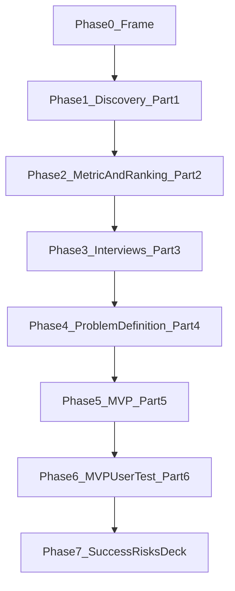
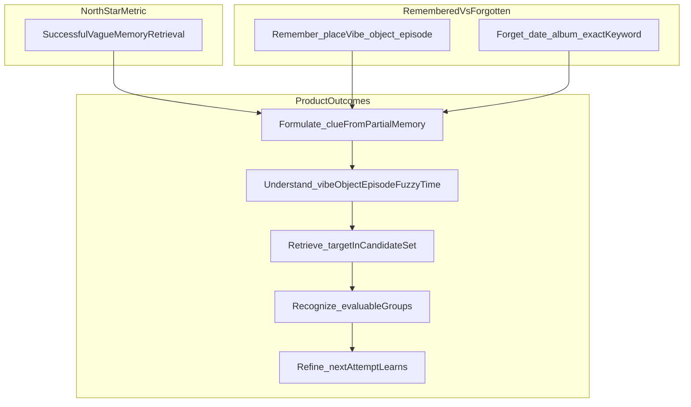

# Problem Statement: Google Photos vague-memory retrieval

> **Assignment brief:** [../projectrequirement.md](../projectrequirement.md)  
> **Architecture (phase-wise build):** [architecture.md](./architecture.md)  
> **Edge cases / acceptance:** [edge-cases.md](./edge-cases.md)  
> **Product:** Google Photos — Core Experience, PM  
> **North-star metric:** Increase the % of users who successfully retrieve a photo they remember but cannot precisely describe when they start searching  
> **Constraint:** Do **not** improve search in general. The job is vague-memory retrieval.  
> **Deadline:** 7 October 2026, 15:59 IST

**Stance:** The brief does not give the user problem. This document frames how we **discover** it. Hypotheses are tools to quantify or kill — they are not decisions. Memory Cue Retrieval is a **working hypothesis for Phase 5 only**, and only if Phase 4’s decision tree still points at formulate / understand (or a rewritten node). The brief’s “Goa café” and “medicine last year” lines are **illustrative tasks**, not the lock ([edge-cases.md](./edge-cases.md) A-F01, A-F05).

**Evaluation bar:** GradProject3 missed cutoff on **clarity/depth** and **creativity**, not on metrics. This narrative stays one problem, one outcome, one shipped job. Part 3 here is the Google Form (G1–G9). A stand-in feature cannot replace the lock.

---

## How to read this document

| Phase | Assignment part | This phase produces | Exit gate |
|-------|-----------------|---------------------|-----------|
| **0 — Frame** | Context | Product, metric definition, constraint | Frame locked |
| **1 — Discovery** | Part 1 | Testable engine + Q1–Q10 evidence + comparable opportunities | `readyForPhase2: true` |
| **2 — Metric + ranking** | Part 2 | Decomposition + ranking **filled from Phase 1 output** | One node + one segment nominated |
| **3 — Form study** | Part 3 | 5–6 in-segment **Google Form** rows; retrieval task seeds | n ≥ 5 S2; matrix filled |
| **4 — Problem definition** | Part 4 | Six required fields + evolution chain | Decision tree → proceed / fork / stop |
| **5 — MVP** | Part 5 | Deployed, testable experience for the **locked** problem | Public URL; stranger can retrieve |
| **6 — MVP user test** | Part 6 | ≥3 return users on Phase 3 tasks | Learnings written |
| **7 — Success, risks, deck** | Parts 7–8 + deliverables | Metrics for the shipped solution; 10-slide PDF | Submission-ready |



**Provisional ≠ decided.** Every table marked provisional must be replaced or struck after the phase that owns the evidence. System design lives in [architecture.md](./architecture.md). Acceptance IDs live in [edge-cases.md](./edge-cases.md).

---

## Executive summary

Over years of use, people accumulate thousands of photos, videos, screenshots, documents, and other visual memories in Google Photos. Search works when they know what to type. It fails when memory is incomplete — they remember a place-vibe, an object, an episode, or a fuzzy time, and have forgotten the date, album, filename, or exact words.

The company’s strategic goal is to **increase the share of users who successfully retrieve a photo they remember but cannot precisely describe when they start searching**. The challenge is not to raise search CTR or make ranking generally better.

The underlying user problem is **not given**. It must be discovered from public voice-of-customer, then validated with 5–6 interviews in a segment chosen from that analysis. The research must explain **why retrieval fails despite partial memory** — not restate “old photos are hard to search.”

This document is the product narrative for that path.

---

## Phase 0 — Frame

**Goal:** Lock product, role, north-star definition, and the “not generic search” constraint.  
**Depends on:** [projectrequirement.md](../projectrequirement.md).  
**This phase produces:** Shared vocabulary for every later phase.  
**Out of scope:** User problem, segment lock, MVP.  
**Exit criteria:** Formula and constraint are unambiguous ([edge-cases.md](./edge-cases.md) A-F02, A-F03).

### 0.1 Role and product

You are a Product Manager on the **Core Experience team at Google Photos**. The product is a personal (and sometimes shared) visual library: photos, videos, screenshots, scans, and Memories surfaces. Users return to it to *relive* and to *find*. Those are different jobs. This project is about the second job when memory is incomplete.

### 0.2 Why vague-memory retrieval is the job

Search already works for **known-item** retrieval — a date, a person’s name that is already tagged, a filename, an exact place. The brief’s failure is different: the user *knows the photo exists* and still cannot start or finish the find.

| Job | What the user has | What search typically demands | In north-star? |
|-----|-------------------|-------------------------------|----------------|
| Known-item search | Date, name, album, exact keyword | The same tokens | **No** — control only |
| **Vague-memory retrieval** | Place-vibe, object, episode, fuzzy time, “that café” | Tokens they have forgotten | **Yes** |

The brief examples are tasks of the second kind:

- “That small café we went to during our Goa trip.”
- “The picture of the medicine I took when I was sick last year.”

They illustrate the *shape* of incomplete memory. They are not the Part 4 problem.

### 0.3 North-star metric

**Successful vague-memory retrieval rate**

```
Successful vague-memory retrieval rate
= users who find the intended photo on a vague-memory task
  / users who start a search with incomplete memory of that photo
```

**Cohort logic (locked):** counted **per started vague-memory task**, not per user-lifetime and not per keyword-known query ([edge-cases.md](./edge-cases.md) P-01, K-05, P-02).

- Numerator: the user confirms the **intended** photo, not a different acceptable one (K-08).
- Denominator: they started with incomplete memory (no date / album / exact filename as the opening clue).
- Finding the photo by scrolling the timeline is a **workaround**, not mechanism success (K-09).
- Day-of-control keyword tasks measure baseline search; they do not move the north-star.

Moving this metric matters because a library people cannot re-enter becomes a write-only backup. Successful retrieval is why people keep capturing, keep backup on, and keep Photos as the default camera roll. Failed retrieval trains them to scroll, to ask someone else, or to leave the product.

### 0.4 Hard constraint

The work is **not** to improve search in general. Out of scope as the core lever:

- Ranking / indexing / latency of the existing search box
- Search CTR, query volume, or “more relevant results” without a vague-memory task
- Storage, backup, Pixel camera, or Locked Folder as the problem
- Claiming production Google Photos telemetry from a prototype

The existing search box is the **baseline to beat** on vague-memory tasks, not the thing to incrementally tune.

---

## Phase 1 — AI-Powered Discovery Engine (Part 1)

**Goal:** Analyze public conversations about photo retrieval **before** proposing a solution. Go beyond sentiment: **identify, quantify, and compare** retrieval failure modes.  
**Depends on:** Phase 0 metric and constraint (so ranking knows what “impact” means).  
**This phase produces:** A testable workflow, Q1–Q10 evidence, validated themes, comparable scores.  
**Out of scope:** Interviews, problem lock, MVP, retrieval APIs.  
**Exit criteria:** `data/discovery/pipeline-stats.json` has `readyForPhase2: true` (≥8 validated themes, quote-linked, Q1–Q10 covered or gapped, storage/ops separated from retrieval). A reviewer can run the workflow and inspect artefacts ([edge-cases.md](./edge-cases.md) A-D01–A-D07).

**Allowed stack:** Claude, GPTs, agents, workflows, RAG, n8n, Zapier, Perplexity, or any AI-native stack. Build details: [architecture.md](./architecture.md) Phase 1.

### 1.1 Testable deliverable (assignment: [Link] AI-Powered Discovery Engine)

| Surface | What a reviewer does |
|---------|----------------------|
| **Primary (Phase 1)** | Run `npm run discovery:refresh`; open `data/discovery/` (`themes.json`, `opportunity-ranking.json`, `pipeline-stats.json`, `validation-results.json`) |
| **Collect fallback** | Paste / CSV ingest when scrapers are blocked |
| **Storefront** | `npm run dev` on :3000 — discovery plus a **hypothesis** Memory Cue Retrieval on Remember. Header search is the **baseline**. Not a Phase 4 lock. |

**Deliverable link:** [http://localhost:3000](http://localhost:3000) — Photos, Remember (hypothesis MVP), baseline Search, Playground, Dashboard, Listen / Questions / Ranking  
**Deck artefact:** 1-slide workflow inside the final 10-slide deck (the only process slide).

### 1.2 Workflow (must compare, not only summarize)

```
Sources → Ingest / normalize / dedupe / retrieval-keyword gate
       → Theme extraction (LLM)
       → Quantification (frequency, cue type, failure node, photo kind)
       → Opportunity ranking (impact on retrieval × MVP feasibility × evidence)
```

Sentiment-only output **fails Part 1**. A theme that is only “make search better” **fails** A-D06.

### 1.3 Research questions → required artefact fields

Brief samples are **Q1–Q4**. **Q5–Q10** are required so ranking is not restated sentiment (A-D07).

| ID | Question | Required fields on matching themes |
|----|----------|-------------------------------------|
| Q1 | What kinds of old photos do users struggle to retrieve? | `photoKind`; ≥2 quotes |
| Q2 | What information do people actually remember about a photo? | `rememberedCue` |
| Q3 | What information have they forgotten? | `forgottenCue` |
| Q4 | How do users formulate searches when memory is incomplete? | Themes tagged **Formulate** |
| Q5 | Where does existing search / Memories / albums break? | Themes tagged **Understand** or **Retrieve** |
| Q6 | What workarounds do people use when search fails? | Workaround tags (scroll, ask, other app, give up) |
| Q7 | How do people vs place-vibe vs object vs event vs screenshot tasks differ? | Comparable frequencies by cue / kind |
| Q8 | What makes a result set evaluable vs overwhelming? | Themes tagged **Recognize** |
| Q9 | How do users refine after a miss? | Themes tagged **Refine** |
| Q10 | Which library / life-context segments struggle most? | `segmentHints` S1–S5 |

If any question has **zero** linked themes after the pipeline, `readyForPhase2` is false unless the gap is logged in `pipeline-stats.json` for interview probing.

### 1.4 Data sources

| Source | What to mine | Retrieval angles |
|--------|--------------|------------------|
| **Play Store** | Google Photos (`com.google.android.apps.photos`) | “Can’t find,” old photos, screenshots, search |
| **App Store RSS** | Google Photos | Same |
| **Reddit** | r/googlephotos, r/google, r/android, r/iphone | Search fails, Memories, albums, “that photo” |
| **YouTube** | “Google Photos search”, “find old photos”, tips | Comments on failed finds |
| **Photos Help Community / forums** | Search, retrieve, Memories | Workaround threads |
| **Collect UI** | Twitter/X, blogs, manual paste | When scrapers fail; interview quotes tagged `primary_research` (excluded from Phase 1 frequency) |

Drop storage-full, backup, crash, and Pixel-camera rants unless a remembered-photo miss is named (D-08, D-14, D-15).

### 1.5 Hypotheses to quantify or kill (not a solution pick)

> Derived from the brief’s examples and publicly observable Photos complaints. Each must be **scored by the engine** and **validated or challenged in interviews** before it can drive Phase 4.

| Theme | Working insight | Evidence target |
|-------|-----------------|-----------------|
| **Place-vibe without a place name** | People remember “small café on the trip,” not the town or date | Trip / holiday / “that place” language |
| **Object + episode** | “The medicine when I was sick” — object is remembered, time is fuzzy | Medicine, receipt, screenshot, document |
| **Forgotten date / album / keyword** | Search demands tokens they no longer have | “I know it’s in there” + failed query |
| **Un-evaluable results** | Something relevant appeared; they could not recognize it | Overwhelming grids, near-misses |
| **Refine dead-end** | First miss teaches nothing; they scroll or quit | “I tried again / gave up” |
| **Screenshot vs memory mix** | Utility photos and memories fail in different ways | Screenshot / scan / PDF complaints |
| **People without a searchable name** | Face known, token forgotten | “Who is” / unlabeled faces |
| **Generic search quality** | Slow / indexing / ranking — **not** the north-star | Quantify; **exclude** from MVP nomination |

### 1.6 Segment hypotheses (for quantification, not lock)

| ID | Segment | Defining behavior | Retrieval relevance | MVP fit (hypothesis) |
|----|---------|-------------------|---------------------|----------------------|
| **S1** | Heavy library | Years of photos; scrolling is hopeless | High — find method must not be the timeline | Medium |
| **S2** | Trip / event rememberer | Place-vibe, holiday, wedding, concert | High — brief’s café shape | High *if* discovery confirms |
| **S3** | Object / document finder | Medicine, receipt, screenshot, ID | High — brief’s medicine shape | High *if* discovery confirms |
| **S4** | People-in-photo finder | Face known; name or tag missing | Medium | Medium |
| **S5** | Shared / family archivist | Partner’s phone; “photos of the kids” | Medium | Low unless lock says so |

**Do not lock a segment until Phase 4.** Do not recruit all five codes. Phase 2 nominates **one**.

### 1.7 Required theme output (compare-ready)

Each theme in `themes.json`:

- Theme name and one-line definition
- `retrievalFailureType` and `metricNode` (formulate / understand / retrieve / recognize / refine)
- `rememberedCue`, `forgottenCue`, `photoKind`
- Estimated frequency
- Representative quotes (2+, with `reviewId` + source; no invented quotes)
- `segmentHints` S1–S5
- `impactOnRetrieval` and `mvpFeasibility`: High / Medium / Low
- `researchQuestionIds`: at least one of Q1–Q10

Ranking formula ([architecture.md](./architecture.md) Phase 1c):

```
score = (0.4 × impactScore) + (0.4 × feasibilityScore) + (0.2 × estimatedFrequency)
```

---

## Phase 2 — Metric decomposition and opportunity ranking (Part 2)

**Goal:** Break **successful retrieval of vaguely remembered photos** into user behaviors and product outcomes; use that tree **together with Phase 1 output** to pick the highest-potential opportunity.  
**Depends on:** Phase 1 artefacts.  
**This phase produces:** Metric tree; **filled** ranking; one nominated node + segment for interviews.  
**Out of scope:** Interviews, problem lock, MVP.  
**Exit criteria:** Ranking filled from files, not guesses. Generic-search-#1 is flagged and not nominated. Exactly **one** primary node (A-M05).

### 2.1 What must change for the north-star to move

Retrieval is not a single step. A vague-memory task succeeds only if the user can **formulate** a clue, the product **understands** it, the **candidate set contains** the photo, the user can **recognize** it, and a miss can be **refined**.



A prettier search box that still demands a date **fails the constraint**. Which node is the bet is an **output of ranking + interviews**, not an input.

### 2.2 Sub-metrics (definitions)

| Sub-metric | Definition | Influences the north-star because… | Validate via |
|------------|------------|-------------------------------------|--------------|
| **Formulation rate** | % of vague-memory attempts that produce a starting clue (not a date/album) | No clue → no retrieval path | Discovery language; interviews |
| **Clue-understanding rate** | % of clues mapped to the cue types the user meant | Misread vibe/object → wrong set | Interviews; later MemoryQuery |
| **Candidate coverage** | % of tasks where the intended photo is in the first grouped set | Coverage miss → cannot recognize | Seed tasks; interviews |
| **Recognition rate** | % of covered tasks where the user opens the intended photo | Overwhelming grids waste coverage | Interviews; `photo_opened` |
| **Refinement success** | % of first-miss tasks that succeed after a refine | Dead-end miss → scroll or quit | Interviews; `refine_used` |
| **Workaround-scroll rate** | % who find the photo only by timeline | Mechanism failed even if the person succeeded | Interviews |
| **Known-item control success** | % of date/filename tasks that still succeed | Guardrail — do not break known-item | Seed `task-control-date` |

### 2.3 Opportunity ranking (filled from Phase 1)

Do **not** treat empty cells as guesses. Copied from `opportunity-ranking.json` via `phase-2/` after Phase 1.

| Opportunity area | Impact | Feasibility | Evidence | Frequency | Node | Rank |
|------------------|--------|-------------|----------|-----------|------|------|
| *empty until Phase 1* | | | | | | |

**Phase 2 decision (from `phase-2/data/nomination.json`):**

- Highest-potential opportunity: **PlaceVibeWithoutName**
- Metric node: **understand** (exactly one)
- Interview segment: **S2 trip / event rememberer**
- Explicitly not pursuing: generic search ranking / indexing (`generic-search-latency`)
- `readyForPhase3`: **true** (Phase 1 `readyForPhase2` is true). This is still not a Part 4 lock.

---

## Phase 3 — Primary research (Part 3)

**Goal:** Validate or challenge Phase 1–2 with **5–6 in-segment S2 Google Form** rows. AI insights are a starting point only.  
**Depends on:** Phase 2 nomination + G1–G9 on the live form.  
**This phase produces:** `docs/research/` notes, validation matrix, synthesis, ≥3 retrieval task seeds for Phase 6.  
**Out of scope:** Final problem lock (Phase 4), MVP.  
**Exit criteria:** n ≥ 5 **in the nominated segment**. If short, **do not lock Phase 4**.  
**Status:** Complete — 6 S2 form records (`r01`–`r06`), [form-census.json](./research/form-census.json).

### 3.1 Target segment (Phase 2 nomination — not locked)

**S2 trip / event rememberer.** Recruit this code only. Do not count mixed S3/S4 users toward n ≥ 5.

### 3.2 Recruitment

**Screener (adapt after nomination):**

- Google Photos is the primary library for ≥ 12 months
- Library large enough that scrolling is not the default find method
- Can recall **at least one** photo they knew existed but failed to find on the first search
- Matches the nominated segment

**Disqualify:** Photos user &lt; 12 months; always finds by scrolling a small library; cannot name a remembered-but-unfound photo; succeeds as soon as they recall a precise keyword (known-item); Google/Photos employee (R-02–R-04, R-08, R-10).

The live form **is** the study: [https://forms.gle/wvQ3pQVQLhxMDFTm9](https://forms.gle/wvQ3pQVQLhxMDFTm9).

### 3.3 Protocol (30 min) — what every interview must recover

**Opening:** Reconstruct one failed find. Stay on that photo until the memory is specific.

| # | Recover this | Why |
|---|--------------|-----|
| 1 | The retrieval task (what photo, roughly when in life) | Scenario for Phase 4 and Phase 6 |
| 2 | What they **remembered** (vibe, object, people, episode, emotion) | Q2 |
| 3 | What they **forgot** (date, album, exact place, keywords) | Q3 |
| 4 | The query they typed — or why they did not search | Formulate |
| 5 | What Photos returned, and whether they could evaluate it | Understand / retrieve / recognize |
| 6 | Workaround (timeline, other device, ask a person, other app, give up) | Q6 |
| 7 | What would have made the photo recognizable in a result set | Recognize |
| 8 | What they tried next after the miss | Refine |

**Closing:** If Photos could accept one thing you *do* remember, what would it be? Do not offer “better search” as the prompt.

Missing the remembered-vs-forgotten reconstruction fails A-R05.

### 3.4 Validation matrix (filled from the form)

| Hypothesis | vs form | Action |
|------------|---------|--------|
| Place-vibe is a used cue that search rejects | **confirmed** | Stay on understand |
| Object + episode is a used cue that search rejects | **not-this-study** | G5 excluded from S2 n |
| Forgotten date/album is the demanded token | **confirmed** as forgotten cue | Product bet stays understand |
| Results are returned but not evaluable | **not-recovered** | Instrument gap — not a disconfirm |
| Refine is a dead end | **weak** | G9 only; no refine transcript |
| Generic search quality is the real complaint | **not-supported** | Did not win; out of brief |
| Known-item success is being mistaken for vague-memory | **excluded** | G9 known-item rows not counted |
| Final segment, scenario, and node for Phase 4 | **S2 / trip-vibe / understand** | n=6; first-break = understand |

**Research artefacts:** `docs/research/screener.md` · `instrument.md` · `interview-guide.md` · `interview-notes/` · `validation-matrix.md` · `synthesis.md` · `form-census.json`. Storefront: `/?view=research`.

---

## Phase 4 — Problem definition (Part 4)

**Goal:** Articulate the problem the brief requires — from evidence, not from the working hypothesis.  
**Depends on:** Phase 1 quantification + Phase 3 matrix.  
**This phase produces:** `docs/problem-definition.md` (lock) and the evolution chain.  
**Out of scope:** Building the MVP. Solution direction is an **input to Phase 5**, not a Phase 4 deliverable.  
**Exit criteria:** All six fields; one-sentence root cause that a mentor can repeat; tree recorded. In-segment n &lt; 5 → **no lock** (A-P07).  
**Status:** Locked — `proceed` · S2 · understand · n=6. Storefront: `/?view=problem`.

### 4.1 Required fields (assignment)

> **Locked: yes.** Verdict: `proceed`. Do not paste a lock onto a slide while in-segment n &lt; 5 (A-P07).

| Field | Statement |
|-------|-----------|
| **Target user segment** | **S2 Trip / event rememberer.** People whose primary Google Photos library is large enough that scrolling is not the find method, who remember a trip or event by vibe (café, lights, boat) and have forgotten the date, album, or town name. |
| **Retrieval scenario** | The café I cannot date — a trip photo the person can still picture when the capture day and place name are gone. |
| **Product outcome** | **understand** — the product accepts vibe, object, episode, and fuzzy time. Exactly one node. |
| **Root cause** | People remember how a place felt on a trip and have forgotten the date, album, and town name, so Search cannot take the clue they still have even though the photo is in the library. |
| **Existing workarounds** | Still unfound, or found by scroll / a person / another app — not a precise keyword (G9). Evidence of the cause, not a backlog. |
| **User value** | Get the intended memory back from the fragments that survived — without reconstructing metadata they no longer have. |
| **Business value** | A library people cannot re-enter becomes a write-only backup. Successful vague-memory retrieval is why they keep capturing, keep backup on, and keep Photos as the default camera roll. |

**Forbidden frame:** “Users find it difficult to search for old photos.” (A-P03)

Discovery quotes stay labeled public voice. Form ticks stay in Google — no invented first-person interview quotes.

### 4.2 Thinking evolution chain (living)

Required by the brief. Told as **what changed**, then locked — do not keep two frames alive (A-P08).

```
Business Metric: Successful vague-memory retrieval rate (not search CTR)
    ↓ decompose (Phase 2)
Product Outcomes: Formulate × Understand × Retrieve × Recognize × Refine — bet = understand
    ↓ AI discovery (Phase 1 — 72 kept posts → 14 themes)
Themes ranked: place-vibe-without-name first; generic-search-latency flagged and excluded
    ↓ primary research (Phase 3 — Google Form G1–G9, in-segment n = 6)
Validation: place-vibe confirmed; forgotten date/album confirmed as cue not bet; generic search not-supported
    ↓ problem definition (Phase 4)
Problem: People remember how a place felt on a trip and have forgotten the date, album, and town name, so Search cannot take the clue they still have even though the photo is in the library.
    ↓ solution direction (input to Phase 5)
MVP direction: Accept place-vibe language so trip rememberers can retrieve a photo they still picture but cannot date or name.
```

### 4.3 Decision tree (gates Phase 5)

From [architecture.md](./architecture.md) Phase 4:

```
IF Phase 3 contradicts the Phase 2 metric node
  → fork: relock outcome; rewrite Phase 5
ELSE IF the dominant failure is generic search ranking / indexing
  → stop: out of brief scope
ELSE IF respondents succeed once they can name a precise keyword
  → stop: this is known-item search, not vague memory
ELSE IF the break is formulate or understand
  → proceed: conversational / memory-cue MVP
ELSE IF the break is retrieve
  → proceed: embedding / caption / metadata matching MVP
ELSE IF the break is recognize
  → proceed: grouping / comparison / “is this it?” MVP
ELSE IF the break is refine
  → proceed: iterative clue-elicitation MVP
ELSE
  → stop; do not ship an ungrounded agent
```

Architecture and edge cases **do not** lock MemoryQuery, converse, or Netlify topology until this tree says proceed. If it says `stop`, there is no MVP — the deck argues the stop (P-10).

---

## Phase 5 — MVP (Part 5) — conditional

**Goal:** Design and **deploy** a functional AI-native MVP for the problem locked in Phase 4, so another person can attempt a retrieval task.  
**Depends on:** Phase 4 decision tree = proceed or fork-with-rewrite.  
**This phase produces:** Publicly testable Remember experience on the Phase 1 storefront.  
**Out of scope:** Real Google OAuth, production Photos libraries, a second Next.js app.  
**Exit criteria:** Publicly testable prototype. Figma-only fails Part 5 (A-V01). Hero UI that is a search box with an LLM behind it fails the creativity bar (A-V05). Locked insight left unbuilt fails lock-equals-ship (A-V06).  
**Status:** Shipped on :3000 — locked understand job. `npm run phase5:setup` · `/mvp` · `/playground` · `/dashboard` · `/demo/task/task-goa-cafe`.

### 5.1 Working hypothesis (locked)

**Memory Cue Retrieval** — the user says what they remember; the system elicits high-value missing cues (at most three, never date-first); maps them to a structured MemoryQuery; searches a representative library; groups candidates so the user can recognize the photo.

| Capability | Node | Status |
|------------|------|--------|
| Accept place-vibe / object / episode / fuzzy time | Understand | **Shipped** |
| Cue elicitation (≤3 questions) | Understand | **Shipped** |
| Grouped candidates with `whyThisGroup` | Recognize (guardrail) | **Shipped** |
| “More like this” / “not this trip” | Refine (guardrail) | **Shipped** |

Intelligence sits at **understand / S2 PlaceVibeWithoutName**. Header Search is the keyword baseline (A-T05), not the hero (A-V05).

| Surface | Role vs problem statement |
|---------|---------------------------|
| **Remember** (`/mvp`, `/?view=find`) | Memory Cue Retrieval — clue composer, elicit ≤3, grouped `whyThisGroup` |
| **Header Search** (`/?view=search`) | Keyword **baseline to beat** (A-T05). Not the hero (A-V05) |
| **Playground** (`/playground`) | Locked S2 tasks from Phase 3; primary action opens Remember |
| **Dashboard** (`/dashboard`) | Prototype funnel; instrumented, not Photos telemetry |
| **Demo task** (`/demo/task/task-goa-cafe`) | Deep link for a stranger |

### 5.2 Form factor

The brief allows a feature-in-Photos, a workflow, a conversational / multimodal experience, an agent, or a standalone prototype.

| Option | Pros | Cons |
|--------|------|------|
| **Standalone Next.js demo** | Fast deploy; testable | Not inside Photos |
| Conversational / multimodal agent | Matches memory language | Needs a seed library |
| n8n + simple UI | Matches brief stack examples | Weaker retrieval UX |
| Figma-only | Realistic frames | **Fails “deployed and testable”** |

**Recommendation:** Photos-like storefront on :3000 (this repo). Seed library of 80–150 photos with near-misses and Phase-3-shaped S2 tasks. Not the user’s real Google account (A-V08). Do not stand up a second Next.js app.

### 5.3 Explicitly out of scope (all Phase 5 variants)

- Real Google OAuth or production Photos libraries
- Official Photos API / on-device ML in the official app
- Generic search ranking as the hero
- Medical or identity advice from a retrieved screenshot
- A second “evidence studio” that buries the retrieval task (A-V07)

**Deployed MVP:** http://localhost:3000/mvp · http://localhost:3000/demo/task/task-goa-cafe · `GET /api/health`

---

## Phase 6 — Test the MVP with users (Part 6)

**Goal:** Return to **at least 3** users from the locked segment; run real or representative retrieval tasks from Phase 3.  
**Depends on:** Phase 5 public (or moderated) URL.  
**This phase produces:** `docs/research/mvp-test-protocol.md`, notes, `mvp-learnings.md`, `GET /api/phase6`, and Test (`/test`, `/?view=test`).  
**Status:** Complete — 3 S2 representative return sessions (`t01`–`t03`). Keyword miss / Remember success on café, Goa trip, purple-lights gig.

- Attempt **baseline keyword search**, then the MVP (A-T05).
- Moderator hints do not count as success (X-03).
- If all three fail, change Phase 5 before claiming success on the deck (X-05).

---

## Phase 7 — Success, risks, and deliverables (Parts 7–8)

**Goal:** Metrics for the **solution actually built**; risks for that solution; 10-slide deck.  
**Depends on:** Phase 4 lock + Phase 5 shape + Phase 6 notes.  
**This phase produces:** Metric hierarchy with definition and rationale; three solution-specific risks; PDF.  
**Exit criteria:** Every metric has both definition and rationale. Risks are not generic. Deck meets brief guidelines.

### 7.1 Metric hierarchy (shape — revise to the shipped job)

| Layer | Metric | Definition | Rationale |
|-------|--------|------------|-----------|
| **North star (proxy)** | Vague-memory retrieval success | `task_success` ÷ `task_started` on vague tasks | Assignment business metric |
| **Leading — formulate** | Clue submitted without date/album | `clue_submitted` | Mechanism: memory language |
| **Leading — understand** | MemoryQuery contains the locked cue type | Converse payload | Mechanism: product accepted the clue |
| **Leading — retrieve** | Target in first grouped set | `target_shown` on seed tasks | Coverage |
| **Leading — recognize** | Target opened from a group | `photo_opened` on target | Evaluable results |
| **Leading — refine** | Success after `refine_used` | Events | Iteration |
| **Diagnostic** | Questions before success; abandon after N | Transcript | Friction |
| **Guardrail** | Control date task still succeeds | `task-control-date` | Do not break known-item |
| **Guardrail** | Hallucinated EXIF rate | Review of `generationMeta` | Trust |

Demo flags are **proxies**. Do not report production Photos telemetry (A-S05).

### 7.2 Risks and mitigations (rewrite after the lock — keep three)

| Risk | Why it might happen | Mitigation |
|------|---------------------|------------|
| **This is just better search** | Mentors see a search box | Creativity bar in Phase 5; A-K02 |
| **People actually remember dates** | Then this is known-item | Phase 4 tree stops; do not ship the agent |
| **LLM invents dates or places** | Fluent but ungrounded | Photo-record grounding; L-03 |
| **In-segment n too small** | Calendar slip | **Do not lock**; recruit — do not title slide 10 as the weakness |
| **Locked insight not shipped** | Scope panic | Stop deploy; no stand-in on slide 8 |

Drop rows that do not apply to the shipped solution. Do not keep a “we did not build the lock” risk (A-K04).

### 7.3 Deliverables checklist

| Deliverable | Status | Link |
|-------------|--------|------|
| **[Link] AI-Powered Discovery Engine** | Not built | TBD |
| **1-slider in deck** (how the engine works) | Draft after Phase 1 | `docs/deck/workflow-diagram.md` |
| **[PDF] 10-slide deck** | Ready | `docs/deck/NL_GooglePhotos.pdf` |
| **[Link] Deployed AI-native MVP** | Local Remember MVP | http://localhost:3000/mvp |
| **Interview notes** | Complete — 6 S2 form records | `docs/research/` · `/?view=research` |
| **MVP test notes** | Complete — 3 S2 representative sessions | `/test` · `docs/research/mvp-test-notes/` |

### 7.4 Deck content map (10 slides max)

Slide titles state the **key message**. Methodology lives **only** on slide 3 ([architecture.md](./architecture.md) Phase 7).

| # | Message the slide must carry |
|---|------------------------------|
| 1 | North-star is successful vague-memory retrieval, not better search |
| 2 | The metric moves only if **[the locked node]** moves — one bet |
| 3 | Discovery engine: public voice becomes ranked opportunities (1-slider) |
| 4 | Ranked retrieval problems — and which one we did not pick |
| 5 | People remember X and forget Y — here is a real task |
| 6 | Root cause (one sentence) |
| 7 | Why this opportunity, for this segment, for Photos |
| 8 | The MVP puts intelligence at **[locked moment]** + public link |
| 9 | Users could / could not retrieve — what we would change |
| 10 | How we will know it worked, and how it could fail (3 risks) |

### 7.5 Deck guidelines (from the brief)

- Fellow name **not** present anywhere (V-01)
- **10 slides max**, title slide included (V-02)
- Titles state the key message — not “Problem” (V-07)
- Font ≥ **14** (Slides/PPT) · ≥ **22** Canva at 1920×1080 · ≥ **26** Figma at 1920×1080 (V-03)
- Readable contrast; colour-blind-safe (labels, not colour alone)
- Hyperlink artefacts; **public access** (V-04)
- File size &lt; 40 MB (V-05)
- Name like `NL_GooglePhotos` (V-06)
- Submit before **7 October 2026, 15:59 IST** — late by seconds is still late (V-17, V-18)

---

## Phase-exit checklist

| # | Action | Gate |
|---|--------|------|
| 1 | Run discovery engine on listed sources | Phase 1 |
| 2 | Fill ranking from artefacts; nominate **one** node and **one** segment | Phase 2 |
| 3 | Collect ≥5 S2 Google Form rows; fill matrix | Phase 3 |
| 4 | Lock `problem-definition.md`; run decision tree | Phase 4 |
| 5 | Build and deploy MVP **only if** tree says proceed; ship the locked job | Phase 5 |
| 6 | Return to ≥3 users on Phase 3 tasks | Phase 6 |
| 7 | Instrument metrics; write 3 risks; 10-slide PDF with public links | Phase 7 |

---

## Appendix A — Assignment cross-reference

| Assignment part | Phase | Section |
|-----------------|-------|---------|
| Part 1: AI-Powered Discovery Engine | 1 | Phase 1 |
| Part 2: Break down the business metric | 2 | Phase 2 |
| Part 3: Validate through user research | 3 | Phase 3 |
| Part 4: Define the problem | 4 | Phase 4 |
| Part 5: Build an AI-native MVP | 5 | Phase 5 |
| Part 6: Test MVP with users | 6 | Phase 6 |
| Part 7: Define success | 7 | §7.1 |
| Part 8: Risks & mitigation | 7 | §7.2 |
| Deliverables + deck | 7 | §7.3–7.5 |

---

## Appendix B — Photos context (for discovery and interviews)

- **Search vs Memories vs albums vs timeline:** Four surfaces; a complaint about Memories is not automatically a vague-memory retrieval miss
- **Screenshots and documents:** Often the “medicine / receipt / ticket” job — different from holiday memories
- **Partner / family libraries:** S5 — “it’s on their phone” is a workaround, not Photos success
- **Competitive set:** Apple Photos, gallery apps, WhatsApp, Files — ask where they go after a miss
- **Locked Folder / backup / storage:** Common review noise; exclude unless a find failed

---

## Appendix C — Mentor tests (before lock and deck freeze)

From [architecture.md](./architecture.md) evaluation bar:

- *Depth:* Why does retrieval fail even though they remember something? Not “the search bar is bad.”
- *Clarity:* The problem sentence needs no footnote.
- *Creativity:* Hide the Photos chrome. If what remains is “type into a box, LLM answers,” it is incremental.
- *Presentation:* Each slide title is a claim. Body proves it with one load-bearing fact.

---

*Document version: 1.0 — evidence-gated to [projectrequirement.md](../projectrequirement.md), [architecture.md](./architecture.md), and [edge-cases.md](./edge-cases.md). Hypotheses pending discovery and primary research.*
